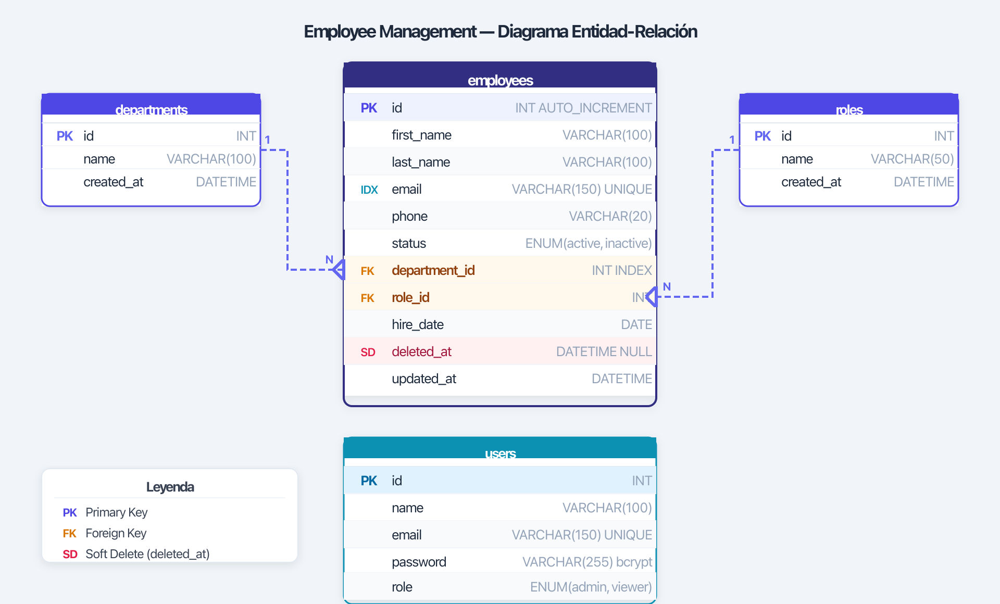
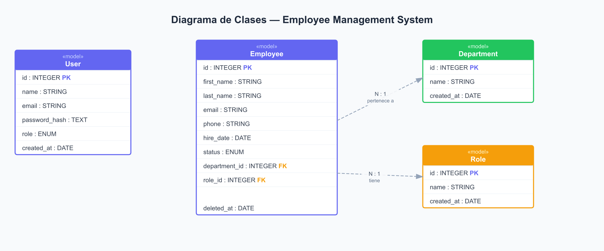
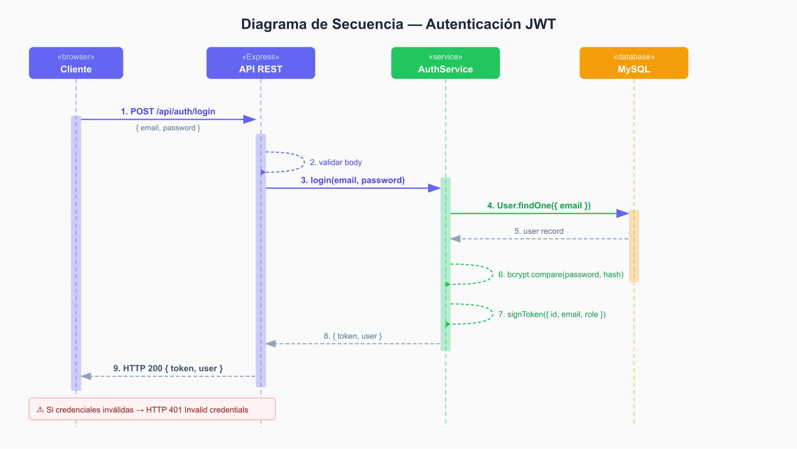
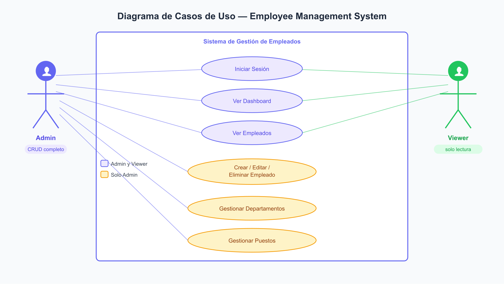

# Employee Management System
### Prueba Técnica Full Stack — NIU Solutions

Sistema web para la gestión de empleados con autenticación JWT, CRUD completo, búsqueda avanzada y panel de métricas.

---

## Stack tecnológico

| Capa | Tecnología |
|------|-----------|
| Frontend | React 18 + Vite + React Hook Form |
| Backend | Express.js + Sequelize ORM |
| Base de datos | MySQL 8 |
| Infraestructura | Docker + Docker Compose |
| CI/CD | GitHub Actions → Docker Hub |

---

## Inicio rápido

> Requisito: tener **Docker Desktop** instalado y corriendo.

```bash
# 1. Clonar el repositorio
git clone https://github.com/201602569/Employee-management-tech-assesment-niu.git
cd Employee-management-tech-assesment-niu

# 2. Copiar variables de entorno (valores demo ya incluidos)
cp .env.example .env

# 3. Levantar todo con un solo comando
docker compose up --build -d
```

El sistema ejecuta automáticamente las migraciones y seeds al iniciar. En 1-2 minutos todos los servicios estarán listos.

| Servicio | URL |
|----------|-----|
| Frontend | http://localhost:5173 |
| API REST | http://localhost:3000 |
| Swagger UI | http://localhost:3000/api-docs |

---

## Credenciales demo

| Rol | Correo | Contraseña | Permisos |
|-----|--------|-----------|----------|
| Admin | admin@demo.com | Admin1234! | CRUD completo |
| Viewer | viewer@demo.com | Viewer1234! | Solo lectura |

---

## Estructura del proyecto

```
├── backend/                  # API Express.js
│   ├── src/
│   │   ├── config/           # Swagger + DB config
│   │   ├── helpers/          # JWT, paginación
│   │   ├── middlewares/      # Auth, validación, errores
│   │   ├── routes/           # Endpoints
│   │   └── services/         # Lógica de negocio
│   ├── migrations/           # Esquema de BD
│   ├── seeders/              # Datos demo
│   ├── models/               # Modelos Sequelize
│   ├── entrypoint.sh         # Auto-migración + seed
│   └── Dockerfile
├── frontend/                 # SPA React
│   ├── src/
│   │   ├── api/              # Cliente HTTP (axios)
│   │   ├── components/       # Componentes reutilizables
│   │   ├── context/          # AuthContext
│   │   ├── hooks/            # useDebounce
│   │   └── pages/            # Login, Dashboard, Employees, Catalogs
│   ├── nginx.conf
│   └── Dockerfile
├── docs/
│   └── ER-diagram.png        # Diagrama entidad-relación
├── .github/
│   └── workflows/ci.yml      # Pipeline CI/CD
├── docker-compose.yml
└── .env.example              # Variables con valores demo listos para usar
```

---

## Setup manual (sin Docker)

### Requisitos
- Node.js 18+
- MySQL 8 corriendo localmente

### Backend

```bash
cd backend
cp .env.example .env
# Editar .env: cambiar DB_HOST=localhost y ajustar credenciales de tu MySQL local

npm install
npm run migrate     # Crea las tablas
npm run seed        # Inserta datos demo
npm run dev         # Puerto 3000
```

### Frontend

```bash
cd frontend
npm install
npm run dev         # Puerto 5173
```

---

## Pruebas unitarias

### Backend (Jest)

```bash
cd backend
npm install
npm test
```

| Suite | Tests | Qué cubre |
|-------|-------|-----------|
| `pagination.test.js` | 6 | Paginación y cálculo de offsets |
| `auth.middleware.test.js` | 10 | Middleware de autenticación y autorización JWT |

### Frontend (Vitest)

```bash
cd frontend
npm install
npm test
```

| Suite | Tests | Qué cubre |
|-------|-------|-----------|
| `useDebounce.test.js` | 4 | Hook de debounce con timers simulados |

---

## API Endpoints

La documentación completa con ejemplos está disponible en **Swagger UI**: `http://localhost:3000/api-docs`

| Método | Endpoint | Descripción | Rol requerido |
|--------|----------|-------------|---------------|
| POST | /api/auth/login | Iniciar sesión (JWT 15min) | — |
| GET | /api/employees | Listar con paginación y filtros | cualquiera |
| POST | /api/employees | Crear empleado | admin |
| PUT | /api/employees/:id | Actualizar empleado | admin |
| DELETE | /api/employees/:id | Soft delete | admin |
| GET | /api/departments | Listar departamentos | cualquiera |
| POST | /api/departments | Crear departamento | admin |
| PUT | /api/departments/:id | Actualizar departamento | admin |
| DELETE | /api/departments/:id | Eliminar departamento | admin |
| GET | /api/roles | Listar puestos | cualquiera |
| POST | /api/roles | Crear puesto | admin |
| PUT | /api/roles/:id | Actualizar puesto | admin |
| DELETE | /api/roles/:id | Eliminar puesto | admin |
| GET | /api/stats | Métricas del dashboard | cualquiera |

### Ejemplo de autenticación

```bash
# Login
curl -X POST http://localhost:3000/api/auth/login \
  -H "Content-Type: application/json" \
  -d '{"email":"admin@demo.com","password":"Admin1234!"}'

# Usar el token en peticiones protegidas
curl http://localhost:3000/api/employees \
  -H "Authorization: Bearer <token>"
```

---

## Funcionalidades implementadas

### Módulo 1 — Base de datos (20 pts)
- ✅ 4 tablas relacionadas: `employees`, `departments`, `roles`, `users`
- ✅ Soft delete con columna `deleted_at` (Sequelize `paranoid: true`)
- ✅ Índices en `email` y `department_id`
- ✅ Esquema en 3FN — diagrama ER en `/docs`
- ✅ `.env.example` con todas las variables

### Módulo 2 — API REST (25 pts)
- ✅ CRUD completo de empleados, departamentos y puestos
- ✅ Paginación: `?page=1&limit=10` → `{ data, total, page, totalPages }`
- ✅ Filtros por nombre, departamento y estado
- ✅ JWT con expiración de 15 minutos — 401/403 según corresponde
- ✅ Validación de body con `express-validator` → `{ error, message }`
- ✅ Rate limiting en `/auth/login`: 5 intentos/min/IP → 429

### Módulo 3 — Frontend React (25 pts)
- ✅ Login con validación cliente y manejo de error 401
- ✅ Rutas protegidas — redirige a `/login` si token expirado
- ✅ Tabla de empleados con paginación server-side
- ✅ Búsqueda con debounce 300ms + filtro por departamento
- ✅ Formulario con React Hook Form — email único, teléfono numérico
- ✅ Modal de confirmación para eliminar (foco atrapado — accesible)
- ✅ Diseño responsivo mobile-first (tabla → cards en móvil)
- ✅ Dashboard con gráficas (Recharts) — datos desde la API
- ✅ Control de acceso por rol en UI: admin ve CRUD, viewer ve solo lectura

### Módulo 4 — Calidad de código (15 pts)
- ✅ Helpers reutilizables: `pagination.js`, `jwt.js`
- ✅ `try/catch` con `throw` en todos los servicios
- ✅ `.env.example` incluido — ningún secreto de producción en el repositorio

### Módulo 5 — Docker y CI/CD (15 pts)
- ✅ `docker-compose.yml` con 3 servicios: `db` + `api` + `frontend`
- ✅ Backend: Dockerfile multi-stage (`builder` → `production`) sin devDependencies
- ✅ Frontend: Dockerfile multi-stage (`builder` → `nginx:alpine`)
- ✅ GitHub Actions: push a `main` → build → push a Docker Hub
- ✅ Swagger UI en `/api-docs` con todos los endpoints documentados

---

## Librerías utilizadas y justificación

| Librería | Justificación |
|----------|--------------|
| `sequelize` | ORM que facilita migraciones, seeds y soft delete (`paranoid`) sin SQL manual |
| `express-rate-limit` | Rate limiting en auth sin infraestructura externa (Redis) |
| `express-validator` | Validación declarativa del body — errores en formato consistente |
| `jsonwebtoken` | Estándar de facto para JWT; control total sobre el payload y expiración |
| `bcryptjs` | Hash de contraseñas con salt — versión pura JS sin dependencias nativas |
| `react-hook-form` | Menos re-renders que Formik; API simple con validación integrada |
| `recharts` | Gráficas declarativas en React sin configuración compleja |
| `axios` | Interceptores para inyectar token y manejar 401 globalmente |
| `react-hot-toast` | Notificaciones no bloqueantes que reemplazan alert() del navegador |

---

## CI/CD

Imagen pública disponible en Docker Hub:

```bash
docker pull christophersoto97/employee-management-api:latest
```

El pipeline se dispara automáticamente en cada push a `main`.

---

## Diagramas

### Entidad-Relación (ER)


### Clases UML


### Secuencia UML — Flujo de autenticación JWT


### Casos de Uso UML

